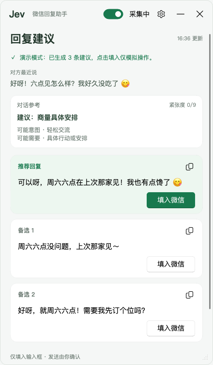
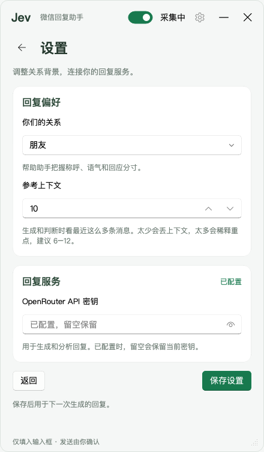
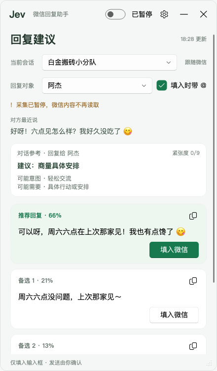

# jev-chat-JARVIS-windows

微信（Windows 4.x）旁挂的回复辅助：本地 OCR 读对方最新消息 → Jev 判断意图/情绪 → 给出 3 条候选回复 →
一键填入微信输入框。**发送永远手动，程序不替你按发送。**

判断内核来自安卓版 [Finderchangchang/jev-chat-JARVIS](https://github.com/Finderchangchang/jev-chat-JARVIS)，
这里把采集换成了 Windows 端的窗口截图 + 离线 OCR。

## 截图

<table>
<tr>
<td width="33%"></td>
<td width="33%"></td>
<td width="33%"></td>
</tr>
<tr>
<td align="center">回复建议：判断摘要 + 3 条候选，★ 推荐那条在最上面</td>
<td align="center">设置：关系背景 + OpenRouter 密钥</td>
<td align="center">采集暂停：不再读微信，已有候选照样能填入</td>
</tr>
</table>

## 隐私与边界

这是个人自用工具，下面几条是硬约束，代码里就是这么写的：

- **只读自己电脑上、自己本来就有权查看的对话。** 不代替任何人查看别人的聊天。
- **只截自己的微信窗口 + 本地离线 OCR（RapidOCR）。** 不 hook、不注入、不读微信数据库、不解密、
  不碰微信进程内存。
- **截图只在内存里。** 捕获到的帧是 numpy 数组，全程不写磁盘、不进日志、不上传，程序里没有 `.save()`。
- **绝不自动发送。** 只把文字粘进输入框就停手，不发回车、不点发送按钮。发不发、改不改，你来定。
- **不碰钱。** 转账、红包、收款相关的界面元素一律不碰。
- **只有对方的新消息到来才调一次模型。** 静默期零调用——十分钟没人说话就是十分钟零 token。
- **API key 只进环境变量。** `setx` 写进 Windows 用户环境变量，任何文件里都不出现 key，
  `config.json` 里只有一个关系设置。

唯一出网的是 `core/` 那几次判断/起草调用（OpenRouter），送出去的是最近若干条对话文本（设置里的「参考上下文」条数，默认 10）和关系设置。OCR 全程离线。

## 工作原理

```
WGC 截微信窗口（GPU 合成窗口也能截，被遮挡也能截）
  → 像素锚点定位消息区（认底色和分隔线，不写死坐标，深浅主题通用）
  → RapidOCR 只认消息区那一块
  → 按气泡颜色分 me / her，灰字（引用块、时间戳、群里的发言人名、链接卡片）过滤掉
  → 跟上一帧比，滚动翻出来的旧消息不重复上报
  → 冒出新的 her 消息才调 core.engine.analyze()
  → 悬浮窗给判断摘要 + 3 条候选 → 点「填入微信」
```

截图和 OCR 跑在独立子进程里（一帧 OCR 250~800ms，放 Qt 主线程界面会僵），父进程只管界面和网络调用。

### 为什么走 OCR

微信 Windows 4.x（进程 `Weixin.exe`，窗口类 `Qt51514QWindowIcon`）界面自绘在一块 GPU 合成画布上
（`MMUIRenderSubWindowHW`）。UIA 树只有 2 个节点、**没有控件树**——`probe/probe_win.py`、
`probe/probe_win2.py` 实测证伪。

所以唯一干净的非侵入采集路 = 截自己的微信窗口 + 本地 OCR。离线、零 token。

## 环境要求

- **Windows 10 1903+ 或 Windows 11**（Windows Graphics Capture 的最低要求）
- **Python 3.10+**
- **微信 Windows 4.x**（`Weixin.exe`）
- **OpenRouter API key**（[openrouter.ai](https://openrouter.ai/)）

> Win10 上 WGC 会在微信窗口外画一圈黄框，系统不给关；Win11 才能关掉。
> 嫌碍眼就把标题栏的采集开关拨到「已暂停」，黄框立刻消失。

## 安装与运行

```bash
git clone https://github.com/rezoch340/jev-chat-JARVIS-windows.git
cd jev-chat-JARVIS-windows
python -m venv .venv
.venv\Scripts\activate
pip install -r requirements.txt
python main.py
```

PyCharm / VS Code 里直接 Run `main.py` 也行。

首次启动会自动弹出设置页：填 OpenRouter API key，选你们的关系（恋人 / 朋友 / 同事 / 家人 / 自定义）。
key 通过 `setx` 写进 Windows 用户环境变量 `OPENROUTER_API_KEY`，重启后依然有效，不落任何文件；
关系写进项目根的 `config.json`（已在 `.gitignore` 里）。

## 使用说明

- **采集开关**：标题栏右上角。拨到「已暂停」就完全不读微信（WGC 会话一起停掉，黄框也没了），
  已经生成的候选照样能填入、能复制。
- **填入微信**：点候选卡片上的「填入微信」，文字进微信输入框，光标留在那儿，**发送你自己按**。
- **复制**：卡片右上角的复制按钮，想手动粘到别处就用它。
- **聊天记录**：底部按钮展开，看 OCR 到底读出了什么，认错了一眼就能发现。
- **设置**：随时改关系背景、key 和参考上下文条数（生成/判断看最近几条消息），下一次生成立即生效，不用重启。

几个注意：

- **微信别最小化。** Windows 不渲染最小化窗口，什么截图法都拿不到画面。程序发现被最小化会无激活还原
  再压到最底下（不抢焦点），但直接用别的窗口盖住微信是更省心的做法——被遮挡不影响 WGC。
- **先只做单聊。** 群聊能识别出发言人名并带在消息里，但分析仍按单聊口径走，结论会偏。

## 项目结构

```
main.py                 入口：父进程只管界面，子进程采集，队列传消息（IDE 直接 Run）
app/                    UI + 采集层
  capture.py            找微信窗口 + WGC 盯帧 + 像素锚点定位消息区；帧全程内存
  ocr.py                RapidOCR 读消息区 → 按气泡颜色分 me/her → 滚动去重
  worker.py             采集子进程主循环（截图 → 定位 → OCR → 去重 → 丢队列）
  fill.py               填入不发送：写剪贴板 → 点输入框 → Ctrl+V，到此为止
  overlay.py            置顶悬浮窗：判断摘要、3 条候选、设置页（PySide6 + Fluent）
  settings.py           key 只进环境变量，关系落 config.json
core/                   Jev 判断内核，平台无关，跟安卓原版同一套口径
  engine.py             唯一入口 analyze(messages, relationship) → 候选 + 排序 + 判断
  jev_client.py         Jev 判断 API 客户端（stdlib、脱敏、429/529 退避）
  questions.py          7 道判断题 + build_state() + build_rank_question()
  draft.py              起草 3 条候选（OpenRouter，默认 DeepSeek）
tools/
  demo.py               端到端冒烟：拿一段写死的对话跑完整链（需 key + 联网）
  preview_ui.py         用合成数据预览界面，不采集不联网不碰微信；可 --screenshot 出图
probe/                  一次性探针，结论已写进本文，留着是为了可复现
  probe_win.py          UIA 能不能读微信聊天文字 → 证伪（树是空的）
  probe_win2.py         UIA 证伪 v2：分清「树是空的」和「有树没文字」，顺带试 LegacyIAccessible
  probe_ocr.py          OCR 读不读得准中文气泡、左右说话人分不分得开
  probe_ocr_speed.py    RapidOCR 一帧多久、裁小能快多少（结论：det_limit_type 必须 'max'）
  probe_ocr_live.py     WGC 持续盯窗口 + 变了就 OCR，新文字实时打控制台
  probe_printwindow.py  试 PrintWindow + PW_RENDERFULLCONTENT 能不能绕开 Win10 黄框（未验证）
docs/KICKOFF.md         最初的需求和硬约束说明
```

`tools/` 和 `probe/` 里的脚本都按「项目根在 `PYTHONPATH` 里」写（PyCharm 默认会把内容根加进去）。
命令行跑 `tools/demo.py` 得自己带上：`set PYTHONPATH=. && python tools/demo.py`。
代码里没有 `sys.path` 补丁。

## 已知限制 / 路线图

- **Win10 黄框**：WGC 的采集提示框，系统不给关，Win11 才行。`probe/probe_printwindow.py` 是
  PrintWindow + `PW_RENDERFULLCONTENT` 的替代方案探针，还没在微信 4.x 上验证过，能出图就能换掉 WGC。
- **输入框拉高超过面板一半会认错消息区**：消息区靠「面板 45% 高度以下第一根分隔线」定位，
  输入框拉太高就会把它当成消息区底线。
- **群聊**：能把发言人名带上，但分析仍按单聊口径，结论会偏。
- **同一人连发两句一模一样的会吞一条**：去重按文本相似度做的。对「要不要触发分析」没影响。
- **`fill` 靠点击输入框坐标**：算的是消息区底线下方 40px，微信改布局就得跟着调。
- **没有托盘**：关窗口就是退出。

## 致谢

- [Finderchangchang/jev-chat-JARVIS](https://github.com/Finderchangchang/jev-chat-JARVIS) — 安卓原版，
  Jev 判断内核和题目口径都来自这里
- [RapidOCR](https://github.com/RapidAI/RapidOCR) — 离线中文 OCR
- [windows-capture](https://github.com/NiiightmareXD/windows-capture) — Windows Graphics Capture 的 Python 绑定
- [PyQt-Fluent-Widgets](https://github.com/zhiyiYo/PyQt-Fluent-Widgets) — 界面组件

## License

MIT，见 [LICENSE](LICENSE)。
